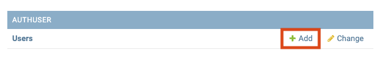
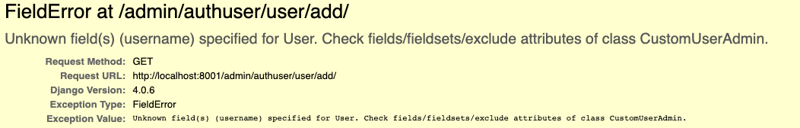

## Issue #1 Demo

This is a minimal demo of [Issue #1](https://github.com/sesh/django-authuser/issues/1) on django-authuser.

To reproduce the bug:

```
git clone https://github.com/geoffbeier/django-authuser-bug-demo.git
cd django-authuser-bug-demo
git submodule update --init --recursive
poetry install
poetry run python ./manage.py migrate
poetry run python ./manage.py createsuperuser
poetry run python ./manage.py runserver 8001
```

Then visit http://localhost:8001/admin and attempt to add a new user.



